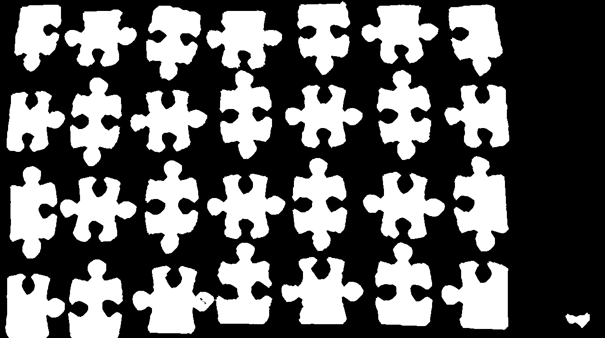
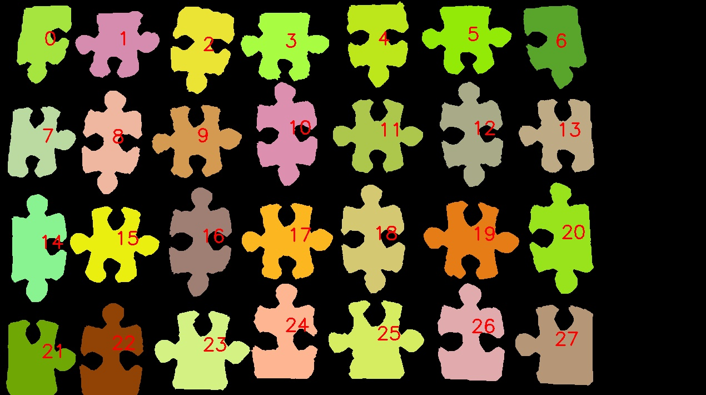
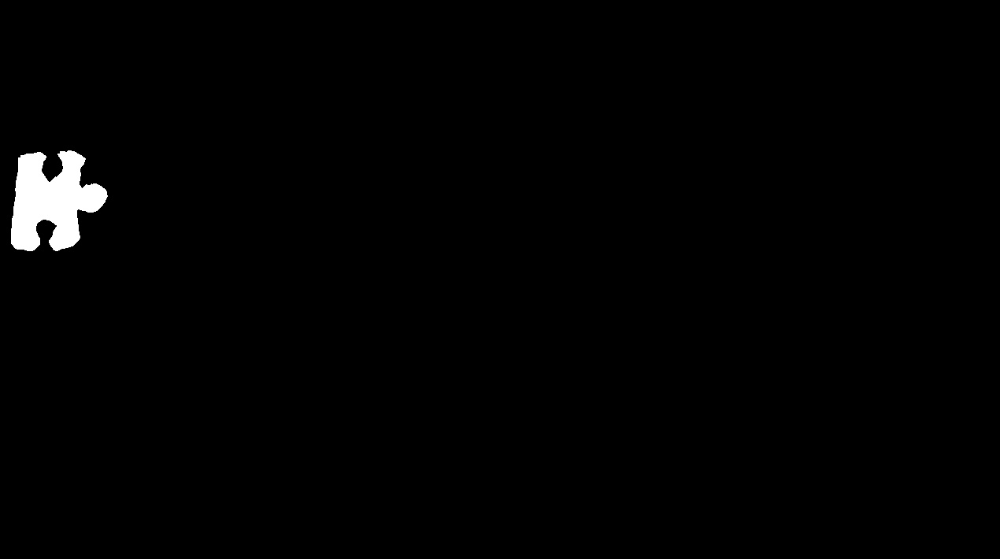
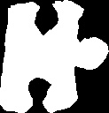
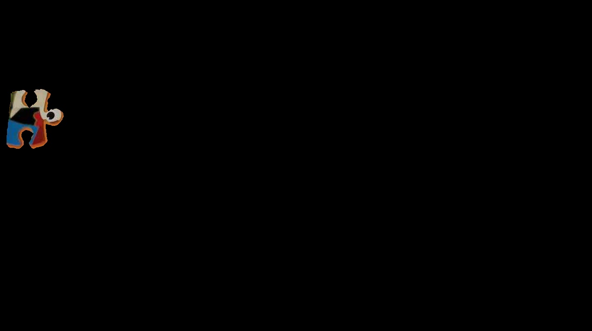
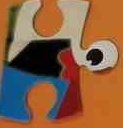
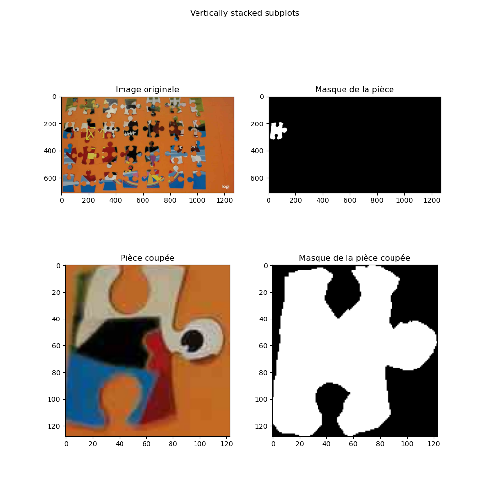
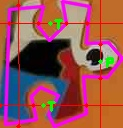
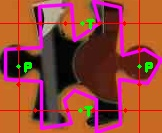

# Analyse : Identification de pièces de puzzle en Python

## Table des matières

- [Contributeurs](#contributeurs)
- [Introduction](#introduction)
  - [Objectif](#objectif)
- [Compilation](#compilation)
  - [Windows](#windows)
  - [macOS](#macos)
  - [Linux (Ubuntu/Debian)](#linux-ubuntudebian)
- [Demarches utilisées](#demarches-utilisées)
  - [1. Création du masque binaire](#1-création-du-masque-binaire)
  - [2. Détection des contours => Identification des pièces](#2-détection-des-contours--identification-des-pièces)
  - [3. Extraction des pièces](#3-extraction-des-pièces)
  - [4. Identification des contours](#4-identification-des-contours)
- [Fonction sort_pieces() : explication](#fonction-sort_pieces--explication)
- [Tests réalisés et complications rencontrées](#tests-réalisés-et-complications-rencontrées)

## ✍️ Contributeurs

- p2006010 - Boulet Benjamin
- p2020351 - Faustmann Lucas

## Introduction

Ce projet a pour but de créer un programme en Python qui permet d'identifier les pièces d'un puzzle.

**image d'origine :**


### Objectif

- **Obtenir un masque binaire pour différencier les pièces du puzzle du fond**
- **Identifier les pièces du puzzle indépendement les unes des autres**
- **Extraire, de l'image originale et des différents masques, différentes vue**
- **Identifier et extraire, les contours de la pièce afin d'identifier les trous et les protubérances**

## Compilation

Voici comment installer Python et les bibliothèques requises sur différents systèmes d'exploitation.

#### Windows

1. Téléchargez et installez Python depuis le site officiel: https://www.python.org/downloads/

2. Ouvrez l'invite de commandes (cmd) et installez les bibliothèques requises en utilisant la commande `pip` :

```bash
pip install opencv-python-headless numpy matplotlib
```

#### macOS

1. Téléchargez et installez Python depuis le site officiel: https://www.python.org/downloads/

2. Ouvrez le terminal et installez les bibliothèques requises en utilisant la commande `pip` :

```bash
pip3 install opencv-python-headless numpy matplotlib
```

#### Linux (Ubuntu/Debian)

1. Ouvrez le terminal et installez Python3 et pip3 en utilisant la commande suivante :

```bash
sudo apt-get install python3 python3-pip
```

2. Installez les bibliothèques requises en utilisant la commande `pip` :

```bash
pip3 install opencv-python-headless numpy matplotlib
```

---

**Une fois que Python et les bibliothèques requises sont installés, vous pouvez exécuter le programme en utilisant la commande suivante :**

```bash
python3 main.py
```

---

## Demarches utilisées

### 1. Création du masque binaire

- on applique un filtre median pour réduire le bruit et applatir les couleurs

- On convertit l'image en LAB pour pouvoir séparer les couleursa

- On calcul grâce à des histogrammes la valeur dominante de chaque canal donc L A et B

- Sur, l'image flouté, on regarde si la valeurs de chaque pixel est proche de la valeur dominante de chaque canal. Si c'est le cas, on colorie le pixel en noir sinon en blanc

- On applique ensuite plusieurs fermeture avec **`cv2.morphologyEx(image,cv2.MORPH_CLOSE, noyau)`**  
   et ouvertures avec  
   **`cv2.morphologyEx(image, cv2.MORPH_OPEN, noyau)`**  
   pour supprimer les petits trous et les petits points blancs

**Masque binaire :**



### 2. Détection des contours => Identification des pièces

- On utilise la fonction **`c2v.findContours(image, ...)`** pour trouver les contours de sur le masque binaire

- on les trie par odre croissant de haut gauche à bas droite ( afin de nous faciliter la tache pour la suite )

**Pièces triées :**



### 3. Extraction des pièces

#### Extraction des masques

- on créer un maque vide de la taille de du masque binaire

- pour chaque pièce, indépendement des autres, on dessine le contour de la pièce sur le masque vide et on fait un **`bitwise_and(masque binaire, masque binaire, mask=notre masque précendent)`** ( ET ) avec le masque binaire pour ne garder que le masque de la pièce.

**Exemple, masque pièce ( grand ) :**



- On rogne ensuite avec le boundingRect du contour de la pièce pour extraire juste le masque de la pièce ( rogné )

**Exemple, masque pièce rogné :**



---

#### Extraction des pièces

- On prend le masque de la pièce trouvé précedemment et on fait un **`bitwise_and(image de base, image de base, mask=masque trouvé précedemment)`** ( ET ) avec l'image de base

**Exemple, image pièce n°7 :**



- De même, on rogne avec le boundingRect du contour de la pièce pour extraire juste la pièce ( rogné ).

**Exemple, image pièce n°7 rogné :**



---

#### On enregistre les images donnée dans leur dossier réspéctif

- **Mask/** , avec **`wideMask/`** pour les grands masques et **`cutMask/`** pour les masques rognés

- **images/**, avec pareil, **`widePieces/`** et **`cutPieces/`**

#### Après toute ces étapes, on arrive à afficher la pièce coupé, son masque, ses contours

**Exemple, pièce n°7 découpage :**



---

### 4. Identification des contours

- On simplifie les contours de la pièce avec **`cv2.approxPolyDP(contour, epsilon, true)`** avec :

  - **contour** : le tableau de contours de la pièce.
  - **epsilon** : paramètre spécifiant la précision de l'approximation.
  - **true** : indique que le polygone approximé doit être fermé. ( polygone fermé ).

- On trace des lignes horizontal et vertical sur chaques bords de la pièce. cad. :

  - **Vertical 1 :** Point 1:{18, 0} à Point 2:{18, Hauteur}
  - **Vertical 2 :** P1:{Longeur - 23, 0 } à P2:{Longeur - 23, Hauteur}
  - **Horizontal 1 :** P1:{0 ; 23} à P2:{Longeur ; 23}
  - **Horizontal 2 :** P1:{0 ; Hauteur - 23} à P2:{Longeur ; Hauteur - 23}

- On parcours ensuite chaque lignes et on compte les points de contact avec les contours grâce à la fonction **`count_line_contact(ligne, contours, image de base)`**
  - **ligne** : la ligne qu'ont étudie.
  - **contours** : le tableau de contours
  - **image..** : image ( pour pouvoir dessiner les points de contact, en rouge )

2 resultats pour une ligne :

- Il y a 4 point de contacts. C'est qu'il y'a un trou !

- Il y'a 2 point de contact. C'est qu'il y'a soit une protubérence soit que c'est le corps de la pièce.  
  Pour les différencier, on calcul la distance entre les 2 points :

  - Si la distance est inférieur à 60 ( arbitraire ), c'est une protubérence. Sinon c'est le corps de la pièce.

- Dans les 2 cas, on calcul la moyenne des points pour trouver le centre de la protubérence ou du trou et on affiche un P ou un T sur ce centre.

#### On applique cette methode sur toutes les pièces et on enregistre le tout dans `image/infoPieces`

**Exemple, pièce n°7 découpage :**



**Exemple, pièce n°11 découpage :**



**P :** Protubérence
**T :** Trou

---

## Fonction sort_pieces() : explication

La fonction sort_contours() prend en entrée une liste de contours, une image et une valeur de tolérance en pourcentage (par défaut 0.1). Elle trie les contours en fonction de leur position dans l'image, d'abord en lignes, puis en colonnes.

- Tout d'abord, la fonction trie les contours en fonction de leur position en Y, puis en X.

- Ensuite, elle calcule une valeur de tolérance verticale en fonction de la hauteur de l'image et du rapport de tolérance donné. Cette tolérance est utilisée pour déterminer si deux contours sont sur la même ligne ( ici on découpe l'img 10% par 10% de img.shape[0] donc l'axe y).

- Les contours sont ensuite parcourus et regroupés en lignes en fonction de leur position en Y et de la tolérance.

- Une fois que tous les contours sont regroupés en lignes, chaque ligne est triée en fonction de la position en X des contours.

- Enfin, la fonction fusionne les contours triés par ligne pour obtenir la liste finale des contours triés par lignes et colonnes.

La fonction retourne la liste des contours triés en fonction de leur position en lignes et en colonnes dans l'image.

`Si la valeur de tolerance_ratio était trop faible, des contours appartenant à la même ligne pourraient être considérés comme étant sur des lignes difféntes car les pièces ne sont pas éxactement sur le même axe et n'ont pas tous la même hauteur. En revanche, si la valeur était trop élevée, des contours appartenant à des lignes différentes pourraient être regroupés dans la même ligne.`

---

## Tests réalisés et complications rencontrées

Pour obtenir le masque binaire, on a commencé au début du projet en utilisant directement l'image en niveaux de gris en utilisant les Tresholds de cv2. Cependant, les résultats n'étaient pas satisfaisants car les pièces étaient souvent mal détectées. On a donc décidé d'utiliser d'autres canaux de couleurs pour obtenir un meilleur résultat. On s'est finalement arrêter sur les canaux L, A et B de l'espace de couleur LAB. On a ensuite fait notre propre fonction de seuillage sur les 3 canaux pour obtenir un masque binaire. On a ensuite tester plusieurs, **...beaucoup**, de combinaisons de transformations morphologiques pour obtenir un masque binaire beaucoup plus propre.
